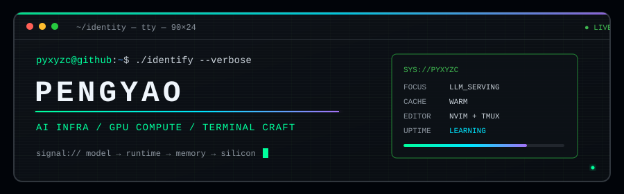

<div align="center">
  
</div>

<div align="center">
  <a href="https://github.com/DenverCoder1/readme-typing-svg">
    
  </a>
</div>

<div align="center">
  <a href="https://github.com/pyxyzc">
    
  </a>
  
  
  
</div>

## `>_ whoami`

```console
pyxyzc@github:~$ ./whoami

name     pengyao
focus    LLM Inference · KV Cache · Heterogeneous Acceleration
tools    Python / C++ / CUDA / Lua
```

## `>_ stack`

<div align="center">
  
  
  
  
  
  
  
  
</div>

## `>_ current.builds`

| PROJECT | DESCRIPTION | STACK |
| :--- | :--- | :---: |
| [`mochitmux.nvim`](https://github.com/pyxyzc/mochitmux.nvim) | Send coding agents into fresh tmux windows from Neovim | `Lua` |
| [`mochidap.nvim`](https://github.com/pyxyzc/mochidap.nvim) | Neovim DAP utilities for a smoother debugging workflow | `Lua` |

## `>_ telemetry`

<div align="center">
  <a href="https://github.com/stats-organization/github-readme-stats-action">
    
  </a>
  <a href="https://github.com/stats-organization/github-readme-stats-action">
    
  </a>
</div>

<div align="center">
  <a href="https://github.com/Platane/snk">
    <picture>
      <source media="(prefers-color-scheme: dark)" srcset="https://raw.githubusercontent.com/pyxyzc/pyxyzc/output/contribution-snake-dark.svg" />
      <source media="(prefers-color-scheme: light)" srcset="https://raw.githubusercontent.com/pyxyzc/pyxyzc/output/contribution-snake.svg" />
      
    </picture>
  </a>
</div>

<br />

<div align="center">
  <code>// keep the cache warm and the terminal green.</code>
</div>
